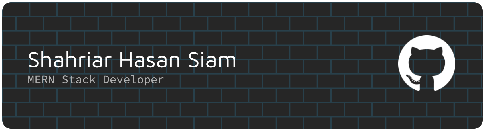

<h1 align="center">
  
</h1>

<h3 align="center">A passionate software developer from Bangladesh</h3>
 

 
 <!-- 🔭 I’m currently working on **FIVERR** -->
 
 🌱 I’m currently learning **Node JS, Python, React Native**

💬 Ask me about **HTML, CSS, Tailwind, ReactJS or anything [here](https://github.com/Starry-NightFall/Starry-NightFall/issues)**

 
  
  
  

 

 

  <h1 align="center">⚒️ Tools and Technologies I Use ⚒️</h1>
   

  <h3 align="left" style="display: flex; align-items: center; gap: 10px;">
    Languages :
    
    
    
    
    
  </h3>

  <h3 align="left" style="display: flex; align-items: center; gap: 10px;">
    Libraries and Frameworks :
    
    
    
    
    
  </h3>

  <h3 align="left" style="display: flex; align-items: center; gap: 10px;">
    Tools and Utilities :
    
    
    
    
    
  </h3>

  <h3 align="left" style="display: flex; align-items: center; gap: 10px;">
    Database, and Hosting :
    
    
    
    
    
    
  </h3>

  <h3 align="left" style="display: flex; align-items: center; gap: 10px;">
    Familiar Operating Systems :
    
    
    
    
  </h3>

 

  <h1>---------------- Contributions ----------------</h1>
   
  
    

  <h1>--------------------- Stats ---------------------</h1>
   

 

<!-- ## 🌱 What I'm Currently Up To

- ⚛️ Learning **React & TypeScript** through Programming Hero
- 🧩 Practicing **Data Structures & Problem Solving with C++** through Phitron
- 🔐 Exploring **Cybersecurity** and building a strong foundation for a future career in the field
- 🖥️ Developing an interest in **Backend Development**
- 🎯 Working toward becoming a strong problem solver and, eventually, a **Cybersecurity Specialist**

## 💬 Ask Me About

- 🔐 Cybersecurity & Ethical Hacking concepts
- 🧠 Programming fundamentals & problem solving
- 💻 My journey into software development and cybersecurity -->
